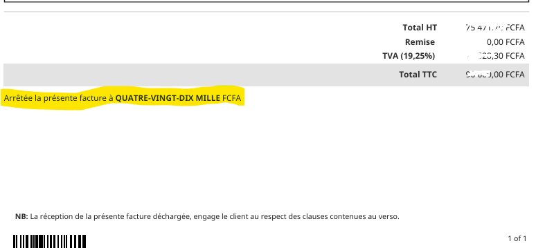

# SuiteScript 2.0 - Conversion du montant en lettres dans les transactions NetSuite

Ce script SuiteScript 2.0 pour NetSuite permet de convertir automatiquement le **montant total** d'une transaction en lettres (par exemple, devis, factures, commandes, etc.) et de l'écrire dans un champ texte personnalisé. La conversion s'adapte à la **langue de l'utilisateur** (anglais et français supportés).



## Fonctionnalités

- **Support multilingue** : Conversion en anglais et en français (extensible à d'autres langues).
- **Prise en charge multi-transactions** :
  - Factures
  - Devis
  - Commandes clients
  - Commandes fournisseurs
  - Avoirs
- **Champ personnalisé dédié** : Le montant converti est écrit dans un champ texte personnalisé (`custbody_total_in_words`).

## Prérequis

1. **NetSuite Sandbox** : Assurez-vous de tester le script dans un environnement sandbox avant de le déployer en production.
2. **Champ personnalisé** : Créez un champ texte personnalisé :
   - **Nom interne** : `custbody_total_in_words`
   - **Type** : Texte
   - **Application** : Transactions

## Installation

1. **Télécharger le script** : Clonez ce dépôt ou téléchargez le fichier `script.js`.
2. **Charger le script dans NetSuite** :
   - Allez dans `Customization > Scripting > Scripts`.
   - Cliquez sur **New Script** et sélectionnez `User Event Script`.
   - Téléchargez le fichier `script.js`.
3. **Déployer le script** :
   - Allez dans `Customization > Scripting > Script Deployments`.
   - Créez un nouveau déploiement pour ce script.
   - Dans **Applies To**, sélectionnez **Transaction**.
   - Ajoutez des filtres si nécessaire pour limiter les types de transactions.

## Configuration

### Modification des langues
Le script prend en charge l'anglais et le français par défaut. Pour ajouter d'autres langues :
1. Ajoutez une nouvelle fonction de conversion pour la langue souhaitée.
2. Modifiez la logique dans `beforeSubmit` pour inclure la nouvelle langue en fonction de la préférence utilisateur.

### Modification des types de transactions
Pour inclure ou exclure des types de transactions :
1. Modifiez la liste `supportedTypes` dans le script :
   ```javascript
   var supportedTypes = [
       'invoice',         // Facture
       'estimate',        // Devis
       'salesorder',      // Commande client
       'purchaseorder',   // Commande fournisseur
       'creditmemo'       // Avoir
   ];

## **Contact**
For questions or suggestions, please contact:  
**Your Name** Olivier KAMDEM | Iam Kto 
**Email:** contact@ktocrea.com 
**GitHub:** [kamdemto]
**Linkedin:** [iamkto]

(https://github.com/kamdemto)